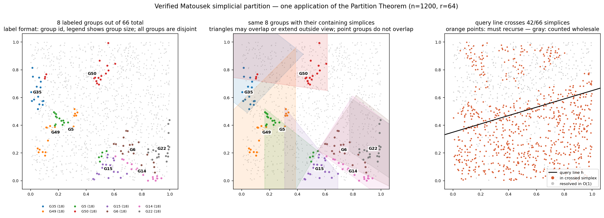
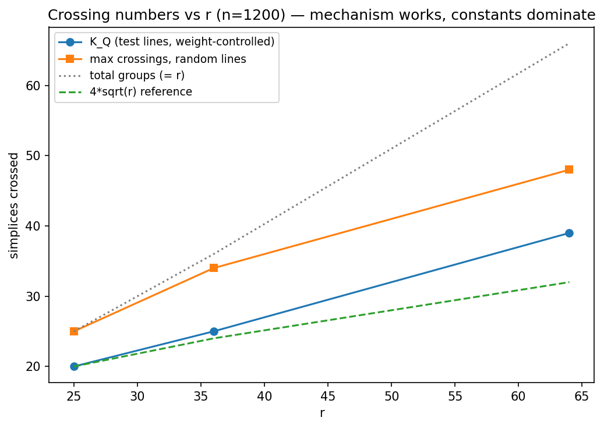

# Matoušek Partition Tree — verified proof-skeleton implementation

[](https://github.com/wangyi1010/matousek-partition-tree/actions/workflows/ci.yml)

A working, runtime-verified implementation of the 2D **Partition Theorem**
(Matoušek 1992) for halfplane range counting — an algorithm that is optimal
on paper and, as far as I can tell, has **no existing library implementation
anywhere**. This project implements the actual proof machinery (point-line
duality, weighted cuttings, exponential reweighting), verifies every
enforceable precondition at runtime, and **measures the constants** that
explain why theory-optimal never shipped.



*n = 1200 points, r = 64: the construction produces 66 disjoint point groups
of sizes in [18, 36). The left panel labels 8 representative groups, the
middle panel shows the same groups inside their containing — possibly
overlapping — simplices, and the right panel shows which groups a halfplane
query must recurse into versus count wholesale in $`O(1)`$.*

## The headline result

The theorem guarantees every line crosses at most $`O(\sqrt r)`$ of the roughly $`r`$ simplices.
Measured on this implementation (n = 1200, seed 7, one theorem application;
`python3 benchmarks/measure_crossings.py` reproduces this table in a few
minutes — exact rational arithmetic is slow):

| $`r`$ | groups | $`\lvert Q\rvert`$ | $`K_Q`$ (test lines) | $`K_Q/\sqrt r`$ | random-line max | lemma bound $`3K_Q+\sqrt r`$ |
|---|---|---|---|---|---|---|
| 25 | 25 | 17 | 20 | 4.00 | 25 | 65 (vacuous) |
| 36 | 36 | 31 | 25 | 4.17 | 34 | 81 (vacuous) |
| 64 | 66 | 55 | 39 | 4.88 | 48 | 125 (vacuous) |



Two things are true at once, and that tension is the point of the project:

- **The mechanism works.** $`K_Q`$ — the crossing count the exponential weights
  directly control — grows like $`\sqrt r`$ with a measured constant of ≈ 4–5, far
  below the group count as r grows.
- **The constants kill it.** The Test Set Lemma transfers the bound to all
  lines as $`\mathrm{cr}(h)\le 3K_Q+\sqrt r`$, which exceeds the total number of groups
  until r is in the hundreds. Below that scale the theorem promises nothing
  about non-test lines — and above it, the exact-arithmetic construction
  already takes minutes. This is why production systems use R-trees and
  kd-trees with no adversarial guarantee instead.

## Complexity calculation

The whole chain, in one place. This is the calculation behind the query bound.

| Symbol | Meaning |
|---|---|
| $`n`$ | number of input points at the current tree node |
| $`s`$ | target size of each point group |
| $`r=n/s`$ | intended number of groups in one partition step |
| $`\Pi`$ | the simplicial partition: point groups plus their containing triangles |
| $`h`$ | an arbitrary query line, i.e. the boundary of a halfplane query |
| $`\mathrm{cr}_\Pi(h)`$ | number of triangles of $`\Pi`$ crossed by line $`h`$ |
| $`Q`$ | finite set of test lines built from dual cutting vertices |
| $`K_Q`$ | worst crossing count among the test lines in $`Q`$ |
| $`T(n)`$ | query time for a subtree containing $`n`$ points |

**Setup.** At one tree node, choose group size $`s`$. Then the intended number
of groups is:

$$r=\frac{n}{s}.$$

The finite test set is constructed so that:

$$|Q|\le r.$$

**Step 1: control only the finite test set.** Exponential reweighting bounds
how many triangles any test line crosses:

$$K_Q = O(\sqrt r).$$

**Step 2: transfer from test lines to every line.** The Test Set Lemma says
that any query line $`h`$ is controlled by three nearby test lines, plus one
extra error term:

$$\mathrm{cr}_\Pi(h) \le 3K_Q + O\left(\frac{n}{s\sqrt r}\right).$$

Here:

- $`3K_Q`$ comes from the three vertices of a dual cutting triangle.
- $`O(n/(s\sqrt r))`$ counts the possible bad simplices not already covered by those three test lines.

**Step 3: simplify the error term.** Since $`r=n/s`$, we get:

$$\frac{n}{s\sqrt r}=\frac{r}{\sqrt r}=\sqrt r.$$

Therefore:

$$\mathrm{cr}_\Pi(h)=O(\sqrt r).$$

So *every* line — not just test lines — crosses $`O(\sqrt r)`$ of the $`r`$ simplices.

**Step 4: turn crossing number into query time.** A halfplane query recurses
only into crossed triangles. The other groups are fully inside or outside the
query halfplane and are counted or discarded wholesale. This gives:

$$T(n) = r + O(\sqrt r)\,T(2n/r).$$

In this recurrence:

- $`r`$ is the work to inspect the groups at the current node.
- $`O(\sqrt r)`$ is the number of children the query may recurse into.
- $`2n/r`$ is the maximum child size, because each group has fewer than $`2n/r`$ points.

Choosing $`r`$ as a sufficiently large constant depending on $`\varepsilon`$
solves the recurrence to:

$$T(n)=O\left(n^{1/2+\varepsilon}\right).$$

the theorem's optimal query time. The measured table above is exactly the
$`K_Q = O(\sqrt r)`$ step, with its constant of ≈ 4–5 made explicit.

## What "verified" means here

Every precondition of the construction that can be checked at runtime is
checked, and violations raise instead of degrading silently:

- **Weighted cuttings** are built by the two-level Chazelle–Friedman scheme
  (coarse $`\sim t`$-line sample, then refinement of heavy cells only — a naive
  $`t\log t`$ sample provably cannot satisfy the $`O(t^2)`$ face budget) and are
  **verified** against both cutting conditions: per-cell crossing weight
  $`\le W/t`$, and face count within the pigeonhole budget $`n_i/s`$. Unverifiable
  cuttings raise `CuttingError`.
- **The test set Q** is the dual of *all* vertices of a fixed-scale
  $`(1/(\beta\sqrt r))`$-cutting of $`P^*`$, $`\beta=0.25`$ fixed. If the cutting has more than $`r`$
  vertices, the code raises `TestSetError` rather than shrinking the cutting
  scale (which would silently invalidate the Test Set Lemma's $`O(n/(s\sqrt r))`$
  conflict bound).
- **Pigeonhole is an assert, not a search**: the face budget guarantees a
  face with $`\ge s`$ remaining points exists.
- **All geometry is exact rational arithmetic** (`fractions.Fraction`);
  boundary contacts follow a general-position convention used consistently
  in construction and verification.
- **Queries are exact** and tested against brute force (CI runs this on
  every push).

The verification discipline caught real bugs during development: a crossing
convention that made the cutting condition unsatisfiable, a naive sampling
scheme that deadlocked against the face budget, and an adaptive β that
quietly destroyed the theorem's cutting scale.

## What this is not

- **Not a certified implementation of the theorem.** Cuttings are built in a
  bounding box that contains the arrangement's full combinatorial structure,
  not the projective plane; the construction is Las Vegas and may raise for
  small r or unlucky seeds; $`\beta\sqrt r\le 1`$ ($`r<16`$) degenerates the test-set
  cutting to a trivial box — the regime where the bound is vacuous anyway.
- **Not a production spatial index.** For the practical counterpart, see
  [`src/matousek_partition_tree/practical.py`](src/matousek_partition_tree/practical.py):
  a float kd-style tree with the *same query skeleton* (classify cell →
  prune / take whole / recurse) that answers the same queries exactly,
  orders of magnitude faster — it just has no worst-case guarantee against
  adversarial query lines. The pair is the point: what the guarantee costs,
  and what industry gave up to go fast.

## Quick start

Python 3.11+, zero runtime dependencies (matplotlib only for figures).

```bash
python3 -m pip install -e ".[dev,viz]"

# proof-skeleton demo: build at r=64, verify 60 queries vs brute force,
# print measured crossing numbers (~20 s)
matousek-demo 1200 42

# practical kd-style baseline (instant)
practical-tree examples/points_example.csv --r 4 --leaf-size 2 --halfplane 1 0 -5

# tests with the coverage gate
pytest tests/ --cov

# reproduce the constants table + scaling plot
python3 benchmarks/measure_crossings.py 1200 7 --plot assets/crossing_scaling.png

# regenerate the figure above
python3 src/visualize_matousek.py 1200 42 assets/partition_tree_example.png
```

## Repository layout

| Path | What |
|---|---|
| `src/matousek_partition_tree/core.py` | the verified proof-skeleton construction + tree + queries |
| `src/matousek_partition_tree/practical.py` | fast kd-style baseline, same query interface |
| `src/visualize_matousek.py` | generates the partition figure from the verified code |
| `src/matousek_partition_tree/{cli,practical_cli}.py` | console scripts `matousek-demo` and `practical-tree` |
| `benchmarks/measure_crossings.py` | K_Q / crossing-number measurement (the table above) |
| `tests/` | postcondition property tests: partition validity, sizes in [s, 2s), simplex containment, cutting conditions, exact-query equivalence |
| `docs/` | self-contained math derivation of the 2D theorem, as GitHub-rendered Markdown plus a typeset PDF (Helvetica Neue / STIX Two Math) built with pandoc + XeLaTeX |

## Theory in one paragraph

Given $`n`$ points and group size $`s`$ ($`r=n/s`$), the theorem builds groups of size
$`[s,2s)`$, each inside a triangle, such that every line crosses only $`O(\sqrt r)`$
triangles. Construction: dualize points to lines; the vertices of a
$`(1/\sqrt r)`$-cutting of the dual, dualized back, form $`\le r`$ *test lines* $`Q`$ such that
controlling Q controls all lines (any line is "sandwiched" by 3 test lines).
Groups are then peeled off round by round: each test line carries weight
$`2^{\kappa}`$ (where $`\kappa`$ counts its crossings so far), and each round takes a $`\ge s`$-point face
from a *weighted* cutting — expensive (often-crossed) lines are avoided by
construction, and a potential argument turns slow total-weight growth into
$`K_Q=O(\log\lvert Q\rvert+\sqrt r)`$. Full derivation with proofs:
[`docs/two_dimensional_partition_theorem_math.md`](docs/two_dimensional_partition_theorem_math.md).

## Citation

Jiří Matoušek, **Efficient Partition Trees**, *Discrete & Computational
Geometry* 8, 315–334, 1992.

Bernard Chazelle, Joel Friedman, **A deterministic view of random sampling
and its use in geometry**, *Combinatorica* 10, 229–249, 1990 (the two-level
cutting construction).
